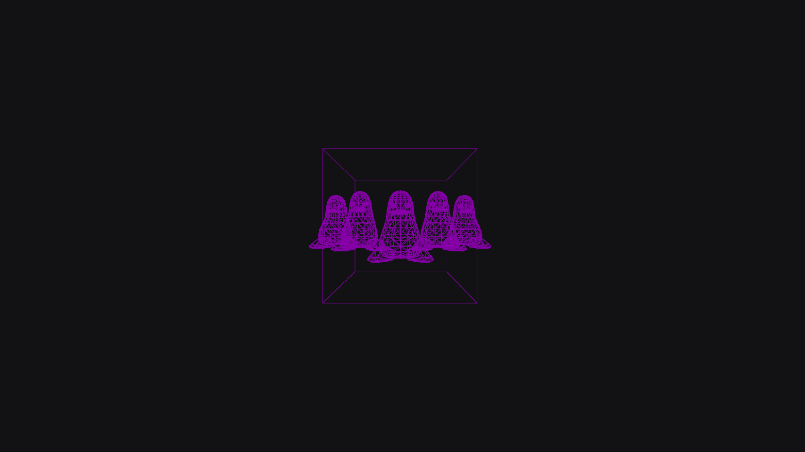
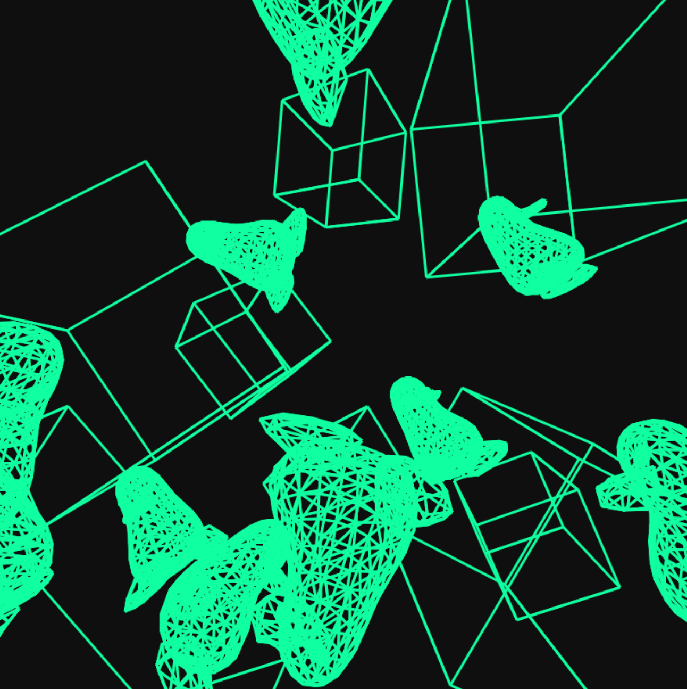

<h1>My 3D-Rendering Website</h1>

<h2>Ver2.0</h2>
Hi there, this version was a reinstated and self made practice version of Version 1, where I introduced and implemented more advanced features like Camera movement, go <a href="https://dominik-salawa.github.io/3D-Rendering-Website/V2.0/index.html">here for Ver2.0</a>.

<h3>What should i know?</h3>
The engine used to render the 3D graphics are self-made and do not rely on previously written code, instead it uses the canvas element in order to draw the graphics manually via canvas.getContext("2d") which means it is CPU-rendered, not GPU (which is why performance after a dozen of pengers are spawned) 
The project can also handle any resolution, so it does not matter if youre playing 1920x1080 or 2560x1440 or idk, just know graphics cannot be messed up by size. 
When entering the game, you will be greeted with a penger in a cube.

<h3>WARNING</h3>
The camera movement is funky, WASD QE and the Arrow keys are strictly related to the direction they face, W only north, S south, A left, D right... so ORIENTATION DOES NOT MATTER AT ALL!! controls labelled with (WARNING) means they are the controls im talking about.

<h3>How do i use this? (CONTROLS)</h3>
There are a couple of controls that are at your disposal: 
<ul>
  <li>WASD - movement (WARNING)</li>
  <li>QE - move up and down (WARNING)</li>
  <li>Arrow keys - move the camera rotation (WARNING)</li>
  
  <li>T - teleport back to spawnpoint</li>
  <li>Y - set new spawnpoint at where you currently are</li>
  <li>Z - completely stop the Cameras velocity</li>
  <li>V - toggle vertice view</li>
  <li>B - toggle wireframe view</li>
  <li>M - delete all existing objects</li>

  <li>1 - select cube to spawn when hitting enter</li>
  <li>2 - select penger to spawn when hitting enter</li>
  <li>Enter - spawn an item of the currently selected at the cameras position but NOT orientation</li>
</ul>
If you are curious: Go back up, click the link, and mess around with my engine. And thanks for reading this far!

<h2>Ver1.0 (OLD)</h2>
Hi there, this project was made in order to understand the basics of how things are rendered. 
In order to use this website, go <a href="https://dominik-salawa.github.io/3D-Rendering-Website/V1.0/index.html">here for Ver1.0</a>.

<h3>How do i use this?</h3>
You create two things...
<ul>
  <li>🐧 Tux penguin</li>
  <li>🧊 Cube</li>
</ul>
Which will randomly appear on a position in the box. 
Thats literally it. 
You can wipe things with the clear button.
AND you can change the FPS rendering from 
1-144 FPS with the sliderand change the wireframe color.

<a href="https://github.com/Max-Kawula/penger-obj">Heres credit to the Tux penguin model (or called Penger)</a>